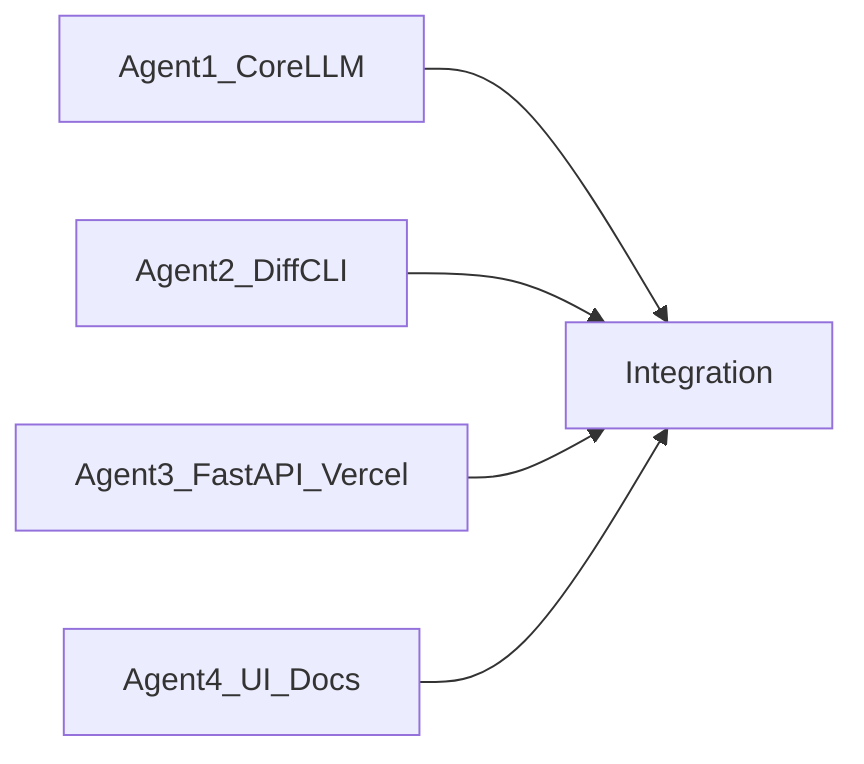

# Prompt Refiner PRD (CLI-first, Vercel)

## 1) Product Goal

Ship an MVP in ~1 hour coding time that helps developers write better next prompts during coding sessions.

Two modes:

- **Suggest mode**: input is git diff only; output is recommended next prompt(s) grounded in current changes.
- **Refine mode**: input is git diff + last prompt; output is (a) what was weak in the prior prompt and (b) a rewritten, spec-driven prompt.

Primary focus: architecture clarity, edge cases, testability, implementation detail quality.

Out of scope: governance/compliance policy checks.

## 2) Users & Use Cases

- Solo devs using Cursor/CLI who want better prompt quality quickly.
- Teams wanting a lightweight prompt-quality assistant while iterating in git.

Core flows:

1. User runs CLI with repo path and mode.
2. System reads git diff from that repo.
3. System calls OpenAI with mode-specific prompt template.
4. System returns plain-text result in terminal.

Stretch flow:

5. User opens simple web UI, enters repo path, chooses mode, and gets same output.

## 3) Functional Requirements

- **FR1 Suggest**: `suggest --repo <path>` uses only git diff.
- **FR2 Refine**: `refine --repo <path> --last-prompt "..."` uses diff + last prompt.
- **FR3 Output contract (plain text, no JSON)**:
  - Suggest returns plain text with: project-understanding summary, recommended next prompt, optional alternates, edge-case checklist.
  - Refine returns plain text with: why the previous prompt is underspecified (requirements/spec/acceptance criteria gaps), rewritten prompt, assumptions to confirm, edge-case checklist.
- **FR4 Diff handling**:
  - Support staged+unstaged changes.
  - Truncate/segment very large diffs safely with clear warning.
- **FR5 OpenAI integration**:
  - Use server-side API key from `.env`.
  - Default model `gpt-4o-mini`.
- **FR6 API endpoints (for Vercel + UI)**:
  - `POST /api/suggest`
  - `POST /api/refine`
- **FR7 Minimal UI (secondary)**:
  - Repo path input, mode selector, optional last prompt textarea for refine, results panel.
- **FR8 Public deployment behavior**:
  - Open endpoint access (no auth/rate limiting for MVP), with explicit warning in docs about abuse/cost risk.

## 4) Non-Functional Requirements

- Fast response under normal diff sizes (<15s target).
- Clear error messages for invalid repo path, empty diff, missing API key, OpenAI/API failures.
- Deterministic text sections (stable heading order for readability).

## 5) Proposed Repo Structure

- [`/Users/virsikand/Desktop/Projects/spec_prompt/app/main.py`](/Users/virsikand/Desktop/Projects/spec_prompt/app/main.py) — CLI entrypoint.
- [`/Users/virsikand/Desktop/Projects/spec_prompt/app/git_diff_getter.py`](/Users/virsikand/Desktop/Projects/spec_prompt/app/git_diff_getter.py) — reads staged/unstaged diffs.
- [`/Users/virsikand/Desktop/Projects/spec_prompt/app/llm/prompt_builder.py`](/Users/virsikand/Desktop/Projects/spec_prompt/app/llm/prompt_builder.py) — suggest/refine prompt templates.
- [`/Users/virsikand/Desktop/Projects/spec_prompt/app/llm/client.py`](/Users/virsikand/Desktop/Projects/spec_prompt/app/llm/client.py) — OpenAI calls.
- [`/Users/virsikand/Desktop/Projects/spec_prompt/app/server.py`](/Users/virsikand/Desktop/Projects/spec_prompt/app/server.py) — FastAPI app exposing `/api/suggest` and `/api/refine`.
- [`/Users/virsikand/Desktop/Projects/spec_prompt/ui/`](/Users/virsikand/Desktop/Projects/spec_prompt/ui/) — minimal front-end (secondary).
- [`/Users/virsikand/Desktop/Projects/spec_prompt/requirements.txt`](/Users/virsikand/Desktop/Projects/spec_prompt/requirements.txt)
- [`/Users/virsikand/Desktop/Projects/spec_prompt/vercel.json`](/Users/virsikand/Desktop/Projects/spec_prompt/vercel.json)
- [`/Users/virsikand/Desktop/Projects/spec_prompt/.env.example`](/Users/virsikand/Desktop/Projects/spec_prompt/.env.example)
- [`/Users/virsikand/Desktop/Projects/spec_prompt/README.md`](/Users/virsikand/Desktop/Projects/spec_prompt/README.md)

## 6) API Contracts

- `POST /api/suggest`
  - Input: `{ "repo_path": "string" }`
  - Output: `text/plain` body with sections for context summary, next prompt, alternates, and edge cases.
- `POST /api/refine`
  - Input: `{ "repo_path": "string", "last_prompt": "string" }`
  - Output: `text/plain` body with sections for underspecification reasons, rewritten prompt, assumptions, and edge cases.

## 7) Prompt Design Principles (Spec-Driven)

Templates must force:

- Objective + explicit scope.
- Architecture constraints and interfaces.
- Edge cases/failure modes.
- Test strategy and acceptance criteria.
- Ordered implementation steps.

## 8) Edge Cases to Cover

- Repo path is invalid or not a git repo.
- Diff is empty.
- Diff too large (truncate and notify).
- Refine mode missing last prompt.
- OpenAI timeout or invalid API key.

## 9) Vercel Deployment Requirements

- Python runtime with FastAPI endpoints.
- Environment variables in Vercel dashboard (`OPENAI_API_KEY`, optional `OPENAI_MODEL`).
- Public URL serving UI and API.
- README section for deploy steps and caveats (open access cost risk).

## 10) Parallel Build Plan (4 Agents)

- **Agent 1 (Core LLM)**
  - Implement `app/llm/client.py` and `app/llm/prompt_builder.py`.
  - Define strong plain-text templates and post-processing helpers for stable section ordering.
- **Agent 2 (Diff + CLI)**
  - Implement `app/git_diff_getter.py` and `app/main.py`.
  - Build `suggest` and `refine` commands and terminal formatting.
- **Agent 3 (Backend + Deploy)**
  - Implement `app/server.py`, `vercel.json`, and API request/response validation.
  - Ensure Vercel-compatible app startup and endpoint routing with `text/plain` responses.
- **Agent 4 (UI + Docs + Packaging)**
  - Build minimal UI for mode selection and inputs.
  - Create `requirements.txt`, `.env.example`, and `README.md` with usage/deploy steps.

## 11) Acceptance Criteria

- CLI suggest/refine both work locally against a git repo.
- API suggest/refine both return stable plain-text sectioned responses.
- Deployed on Vercel with OpenAI key configured.
- README includes local run + deploy instructions.
- Secondary UI can call API for suggest/refine in deployed environment.

## 12) Timeboxing

- 10 min: scaffold + dependencies.
- 20 min: LLM prompt builder + client.
- 15 min: CLI + diff extraction.
- 10 min: FastAPI + Vercel config.
- 5 min: UI skeleton/docs/polish.
